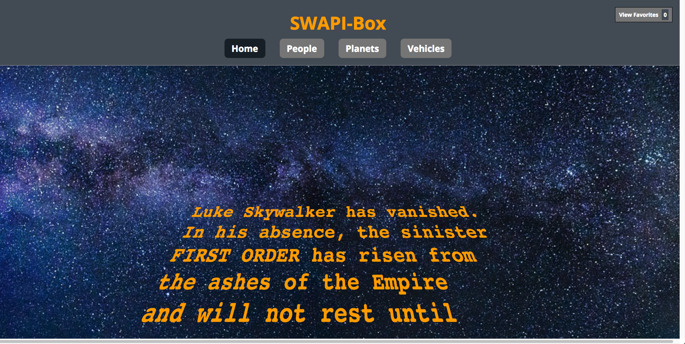
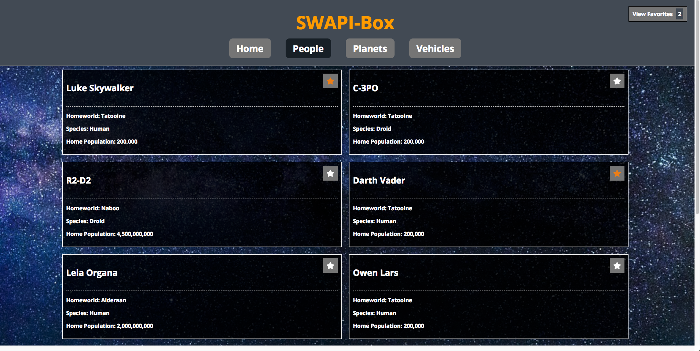

# SWAPI-Box
## By: Jonathan Sweet

## Description:
SWAPI-Box is a fun project utilizing the StarWars API. The purpose of this project was to gain experience with using and testing asynchronous javascript. Built with create-react-app, this project has 3 stateful components managing the application and numerous stateless, functional components. Additionally, Router v4 is implemented in this project to allow for easy navigation and fetching of data based on the route the user takes. To limit stress on the StarWars API and decrease loading times, categorical data is stored in localStorage along with objects corresponding to the vehicles, planets, and people that the user has favorited. On initial page load or when the user returns to the home screen, a random "opening crawl" from one of the seven movies in the database is displayed and animated to look similar to an actual movie.

## Future
Future features may include a search input with a select box to allow the user to search within a specific category.